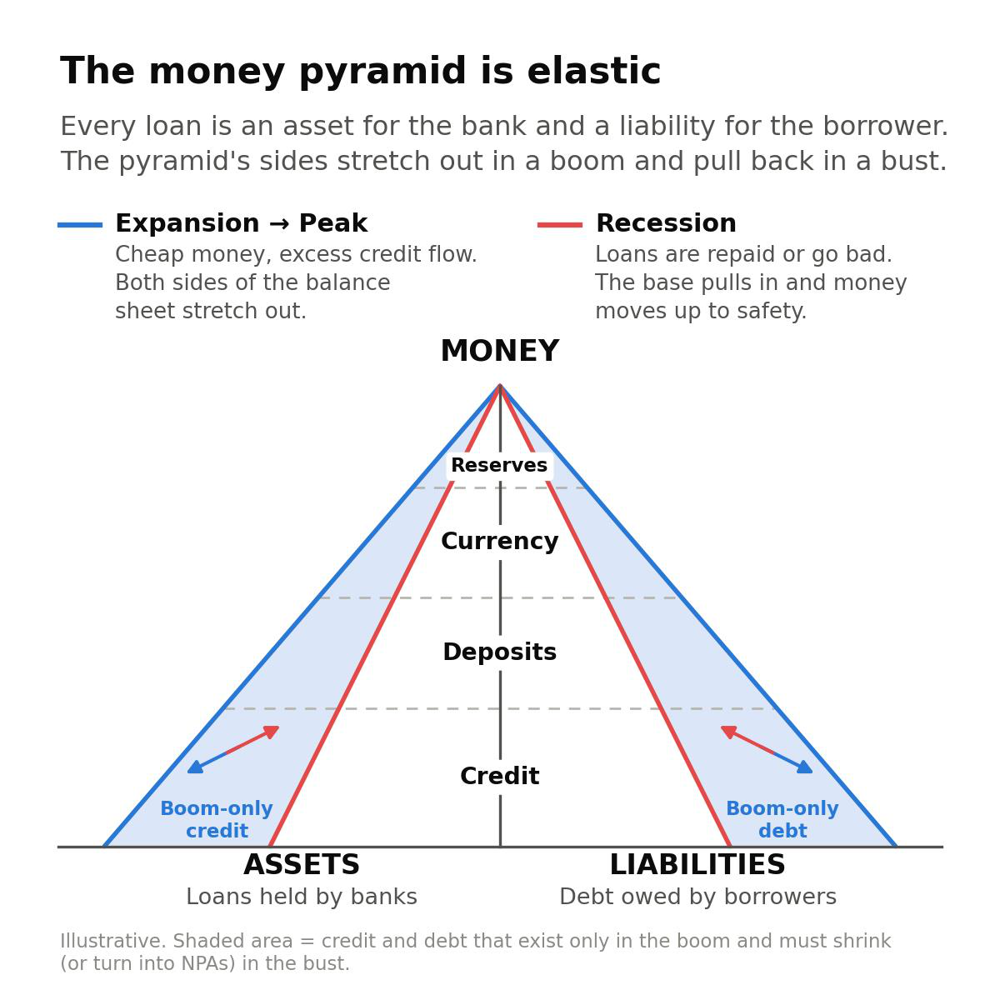
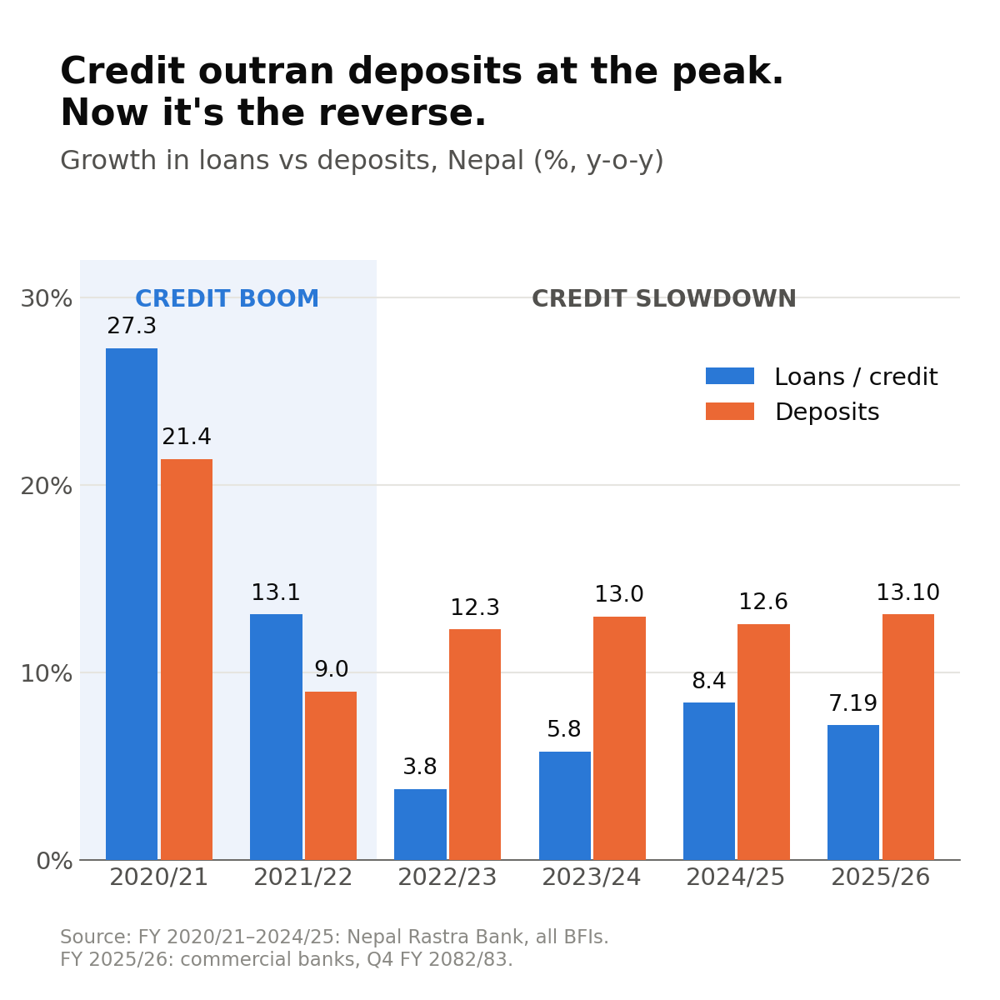
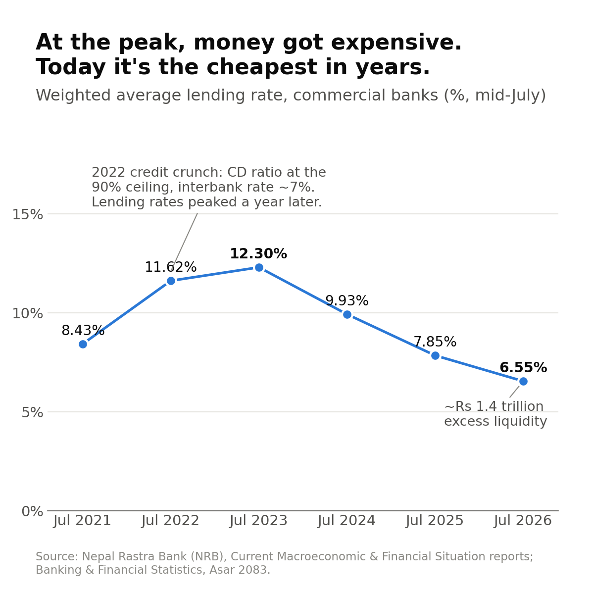
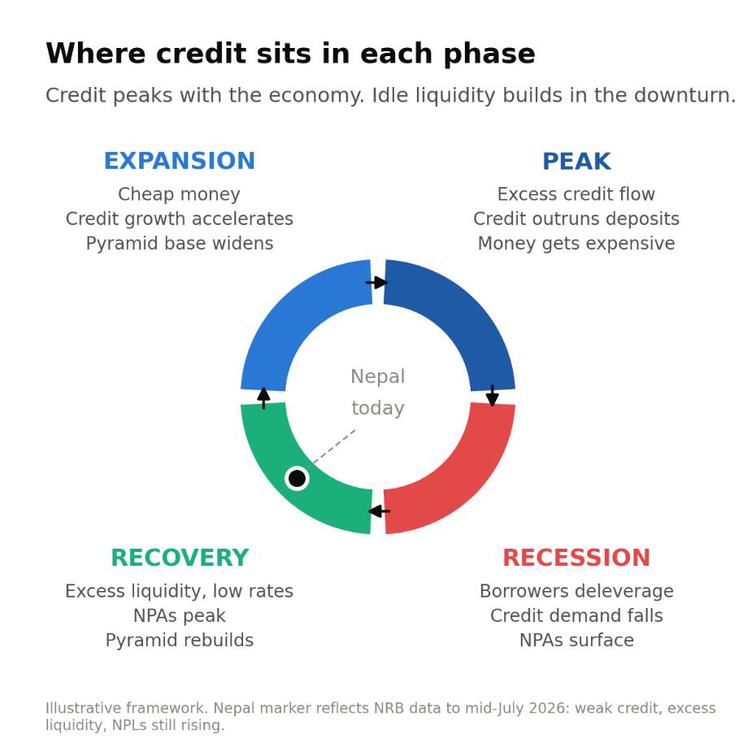
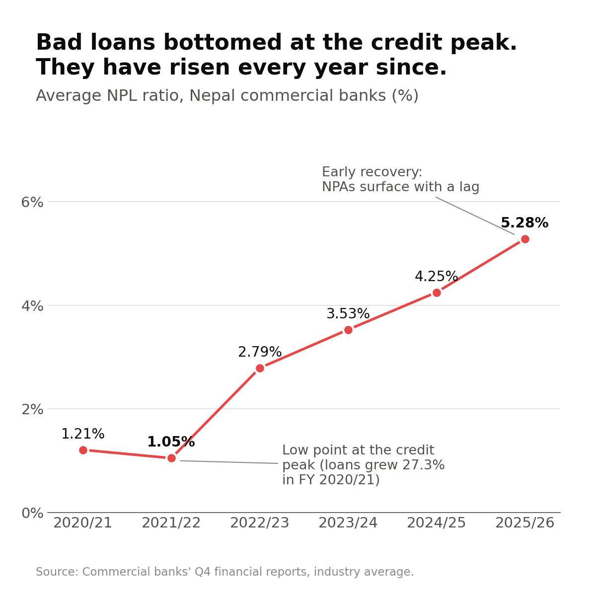
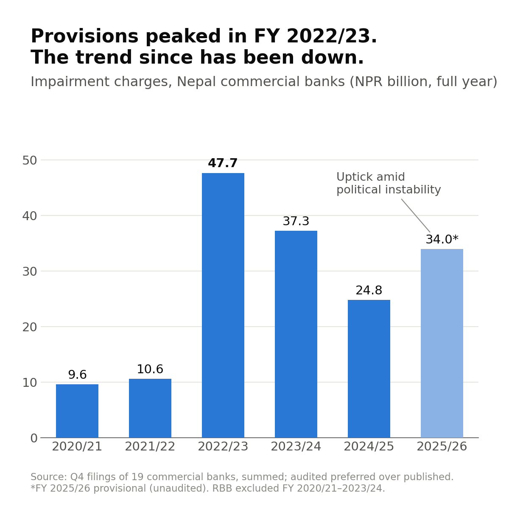

Over the last four years, bad loans at Nepal's banks have risen from about 1% of all loans to more than 5%. Many people see this as a sign that something is deeply wrong with our banking system. This note argues something different: that rising bad loans are a normal part of a cycle every banking system goes through, and that Nepal may now be close to the worst point of that cycle.

To see why, we need to understand three things in order: how money works, how it moves with the economy, and how bad loans follow that movement.

## Start with money itself

Not all money is equal. Money works like a pyramid, with the safest money at the top and the riskiest at the bottom.

At the top sits the safest money of all: the reserves held by the central bank. For Nepal, this means NRB's foreign exchange reserves, which also back the fixed exchange rate between the Nepali and Indian rupee. Below that is cash in our pockets and the deposits we keep in banks. At the bottom is credit, which is simply a promise to pay back later. A loan is money today in exchange for a promise about tomorrow.

Every loan sits on two sides at once. For the bank, it is something it owns: an asset that should earn interest. For the borrower, it is something they owe: a liability. The top of the pyramid barely changes over time. The bottom, where credit sits, is elastic. It stretches out when times are good and shrinks when times are bad.

Think of a tent held up by a center pole. The pole is the central bank's money, and it stays in place. The ropes are credit. In good weather you stretch the ropes wide and the tent covers more ground. When a storm comes, you pull them in, and any rope that was stretched too far is the one that snaps. Those snapped ropes are the bad loans.

*Figure 1: The money pyramid stretches out in good times and pulls back in bad times.*

> **In short:** the money at the top stays fixed; the credit at the bottom grows in a boom and shrinks in a bust.

## The pyramid grows and shrinks with the economy

**In the good times (expansion to peak).** When interest rates are low, borrowing is cheap. Businesses borrow to expand and families borrow to buy homes and cars. Banks lend eagerly, and the bottom of the pyramid widens. By the peak, loans are growing faster than the deposits that fund them.

Nepal went through exactly this. In FY 2020/21, right after the COVID lockdowns, bank loans grew by 27.3% in a single year, while deposits grew by 21.4%. Banks were lending out money faster than it was coming in. By 2021/22, many banks had reached NRB's limit of lending Rs 90 for every Rs 100 of deposits. Money in the banking system ran short. Banks competed for deposits, and the rate at which banks lend to each other shot up to around 7%, a record at the time. Money had become scarce and expensive.

**When the cycle turns.** After a boom, the pyramid shrinks. Borrowers stop taking new loans and focus on paying off old ones. Businesses delay expansion. Demand for credit slows, and money moves back up the pyramid into the safety of deposits. Since FY 2022/23, deposits in Nepal have grown faster than loans every single year.

*Figure 2: Loans grew faster than deposits in the boom; deposits have grown faster ever since.*

Interest rates tell the same story. The average rate that commercial banks charge on loans rose from 8.43% in July 2021 to 12.30% in July 2023. It peaked a year after the cash shortage, because existing loans take time to be re-priced at new rates. Since then, as money has piled up in banks, rates have fallen to 6.55%, the lowest in years.

*Figure 3: Loan rates peaked after the cash shortage and have almost halved since.*

> **In short:** in a boom, loans outrun deposits and money gets expensive; after the boom, deposits pile up and money gets cheap.

## Where Nepal's banks stand today

Nepal's commercial banks are now clearly on the shrinking side of the pyramid. At the end of FY 2082/83 (Q4):

- **Deposits grew by 13.10%, but loans grew by only 7.19%.** More money is coming in than is going out as loans.
- **The CD ratio has fallen to 72.68%.** Banks are lending about Rs 73 for every Rs 100 of deposits, well below the Rs 90 limit. They have room to lend much more.
- **The average NPL ratio is 5.28%.** About Rs 5 of every Rs 100 lent has gone bad.
- **Around Rs 1.4 trillion of spare money** in the banking system is sitting idle, parked largely with NRB.

In other words, there is plenty of money available to lend. But the economy is still in the early stage of recovery, and people and businesses are not yet borrowing much. That gap between money available and money actually lent is where the story of bad loans begins.

> **In short:** banks have money to lend; what is missing, for now, is demand to borrow.

## Bad loans follow the economy, but with a delay

Bad loans do not rise and fall at the same time as the economy. They follow it, with a delay of a year or two. Here is how it plays out:

1. **Early expansion.** Money is cheap, businesses are earning well and borrowers pay on time. Bad loans are at their lowest. But this is also when the riskiest loans are made, because cheap money makes every project look good and banks relax their checks.
2. **The peak.** As lending runs ahead of deposits, money becomes scarce and expensive. Loans taken at low rates now cost more. A borrower who took a loan at 8% may suddenly be paying 12%, just as business begins to slow.
3. **The downturn.** Sales fall, costs stay high and some borrowers can no longer keep up with their payments. The weak loans made in the good times start to fail.
4. **Early recovery.** Bad loans usually peak here, even as the economy starts to improve. That is because a loan takes time to go from "struggling" to officially "bad". Missed payments build up over months before the loan is counted as non-performing.

A simple way to picture it: bad loans are like a hangover. The drinking happens at the party, which is the boom. The headache arrives the next morning, which is the downturn and early recovery. And by the time the headache is at its worst, the party is long over.

*Figure 4: Credit peaks with the economy; bad loans peak later, in the downturn and early recovery.*

> **In short:** bad loans are made in the boom and show up in the bust.

## Nepal is a textbook case

Nepal's numbers follow this pattern almost exactly. In 2021/22, at the height of the lending boom that followed 27.3% loan growth in FY 2020/21, the average NPL ratio of commercial banks was just 1.05%. Everything looked healthy. As the cycle turned, bad loans rose every year: 2.79%, then 3.53%, then 4.25%, and now 5.28%.

Nepal is now in recovery, yet bad loans are still rising. This can look like a contradiction, but it is exactly what the delay predicts. Today's bad loans are, in large part, the loans made during the boom finally showing their weakness.

*Figure 5: Bad loans hit their lowest point at the height of the boom and have risen every year since.*

> **In short:** today's rise in bad loans is mostly the boom of 2020–22 catching up.

## A better early signal: what banks set aside

If bad loans are still rising, how can we tell when the worst is over? The answer lies in how much banks set aside each year to cover losses.

There are two different measures, and it helps to keep them apart. The NPL ratio is like the total number of patients in a hospital: everyone admitted so far and not yet discharged. The yearly provision, or impairment charge, is like the number of new patients admitted this year. The total can keep rising even when fewer new patients are coming in. The number of new admissions tells you first that the outbreak is slowing.

Nepal's commercial banks set aside the most money in FY 2022/23, a total of Rs 47.7 billion. Since then, that amount has fallen to Rs 37.3 billion and then Rs 24.8 billion. In other words, banks took the pain early. They set money aside as soon as they saw trouble coming. Since then, even as more loans have turned bad, each year has needed less new money set aside.

FY 2025/26 saw a rise to Rs 34.0 billion, during a year of political instability in the country. But it remains well below the FY 2022/23 peak, and the broader trend is still downward.

*Figure 6: What banks set aside for bad loans peaked in FY 2022/23, well before the NPL ratio.*

> **In short:** the money banks set aside for bad loans peaked years ago, and that is an early sign the worst is passing.

## What comes next: fewer bad loans, better profits

We believe the worst of this cycle is behind us, for three reasons:

- **The economy is recovering.** As businesses earn more, fewer borrowers will fall behind on payments.
- **Borrowing is much cheaper.** Loan rates have fallen from about 12% to under 7%. For a borrower, that is a big cut in the monthly payment, which makes it easier to keep up.
- **The weak loans have been found.** Most of the risky loans made during the boom have already been tested and counted as bad.

As the recovery takes hold, we expect bad loans to start softening. The path may not be smooth, and bad loans could still tick up for a quarter or two, but the cycle suggests the peak is near.

This matters for bank profits. The money banks set aside for bad loans comes straight out of their profits. When a struggling borrower recovers and starts paying again, the bank can release that money back, and it flows back into profit. Fewer new bad loans also mean less needs to be set aside in the first place. Both help profits.

There is one catch. With interest rates this low, banks earn less on every loan they make, so their margins will stay thin for now. The real boost to profits will come when people and businesses start borrowing again. If the economy moves from recovery into a full expansion, we expect bank profits not only to rise but to stay at a higher level.

> **In short:** as bad loans soften, money set aside comes back as profit; when lending picks up, profits should follow.

## Conclusion

Banking is a cyclical business. Good times create the loans that go bad in hard times, and hard times clear the way for the next good times. Bad loans are born in the boom and surface in the bust.

Nepal has gone through the boom of 2020–22, the cash shortage and high rates that followed, and several years of rising bad loans. Today, money is plentiful, rates are low and banks have already set aside most of what they needed. For Nepal, the NPA cycle appears to be nearing its peak.
